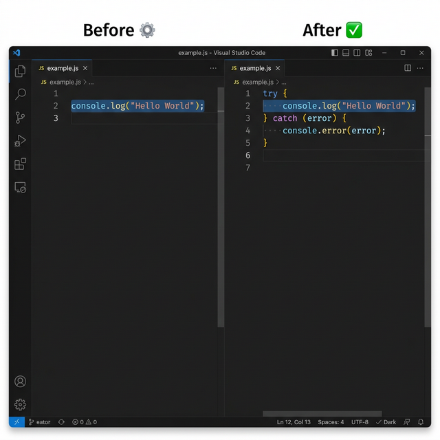

# 🛡️ Wrap Selection in Try-Catch

> Instantly wrap any selected code in a `try-catch` block — with a single command, right inside VS Code.



---

## 📌 What Does This Extension Do?

Writing `try-catch` blocks by hand is repetitive and breaks your focus. This extension lets you **select any block of code** and wrap it in a properly indented `try-catch` block in one step.

It automatically:
- Detects the **indentation level** of your selected code
- Wraps it inside `try { }` with correct inner indentation
- Adds a `catch (error)` block with `console.error(error)` ready to go

---

## ✨ Features

- ⚡ **Instant wrapping** — one command, zero typing
- 🎯 **Smart indentation** — preserves your code's existing indent level
- 🧠 **Works with any language** — JavaScript, TypeScript, and more
- 🪶 **Lightweight** — no dependencies, no bloat

---

## 🔧 Installation

### Option 1: Install from `.vsix` (Local)

1. Download the `.vsix` file (`warp-select-try-catch-0.0.1.vsix`)
2. Open VS Code
3. Press `Ctrl+Shift+P` to open the Command Palette
4. Type **"Extensions: Install from VSIX..."** and press `Enter`
5. Browse to and select the `.vsix` file
6. Reload VS Code when prompted — done! ✅

### Option 2: Install from VS Code Marketplace

> Coming soon — will be available directly from the Extensions panel.

---

## 🚀 How to Use

### Step 1 — Select your code

Click and drag to highlight the code you want to wrap in a `try-catch`.

```js
// Select this line (or any block of code):
const data = JSON.parse(rawInput);
```

### Step 2 — Run the command

Open the **Command Palette** with `Ctrl+Shift+P`, then type:

```
Wrap Selection in Try-Catch
```

Press `Enter`.

### Step 3 — Done! ✅

Your selected code is instantly wrapped:

```js
try {
    const data = JSON.parse(rawInput);
} catch (error) {
    console.error(error);
}
```

---

## 💡 Real-World Examples

### Example 1 — Single line

**Before (selected):**
```js
fs.writeFileSync('output.txt', content);
```

**After:**
```js
try {
    fs.writeFileSync('output.txt', content);
} catch (error) {
    console.error(error);
}
```

---

### Example 2 — Multiple lines

**Before (selected):**
```js
const res = await fetch(url);
const data = await res.json();
console.log(data);
```

**After:**
```js
try {
    const res = await fetch(url);
    const data = await res.json();
    console.log(data);
} catch (error) {
    console.error(error);
}
```

---

### Example 3 — Nested / indented code

**Before (selected, already inside a function):**
```js
function loadUser() {
    const user = db.findUser(id);
    return user;
}
```

**After:**
```js
function loadUser() {
    try {
        const user = db.findUser(id);
        return user;
    } catch (error) {
        console.error(error);
    }
}
```

The extension **respects your existing indentation** at all levels.

---

## ⌨️ Keyboard Shortcut (Optional)

You can bind the command to a custom keyboard shortcut for even faster access:

1. Open **File → Preferences → Keyboard Shortcuts** (or `Ctrl+K Ctrl+S`)
2. Search for `Wrap Selection in Try-Catch`
3. Click the `+` icon and assign your preferred shortcut (e.g. `Ctrl+Alt+T`)

---

## 🛠️ Requirements

- VS Code version `1.87.0` or higher
- No additional dependencies required

---

## 🐛 Known Issues

- If no text is selected when the command runs, an error message will appear — simply select some code first.
- Empty selections are ignored gracefully.

---

## 📝 Release Notes

### 0.0.1 — Initial Release
- Wrap any selected code in a `try-catch` block
- Smart indentation detection and preservation
- Error feedback when no text is selected

---

## 🤝 Contributing

Have an idea or found a bug? Feel free to open an issue or submit a pull request.

---

## 📄 License

[MIT](LICENSE)
